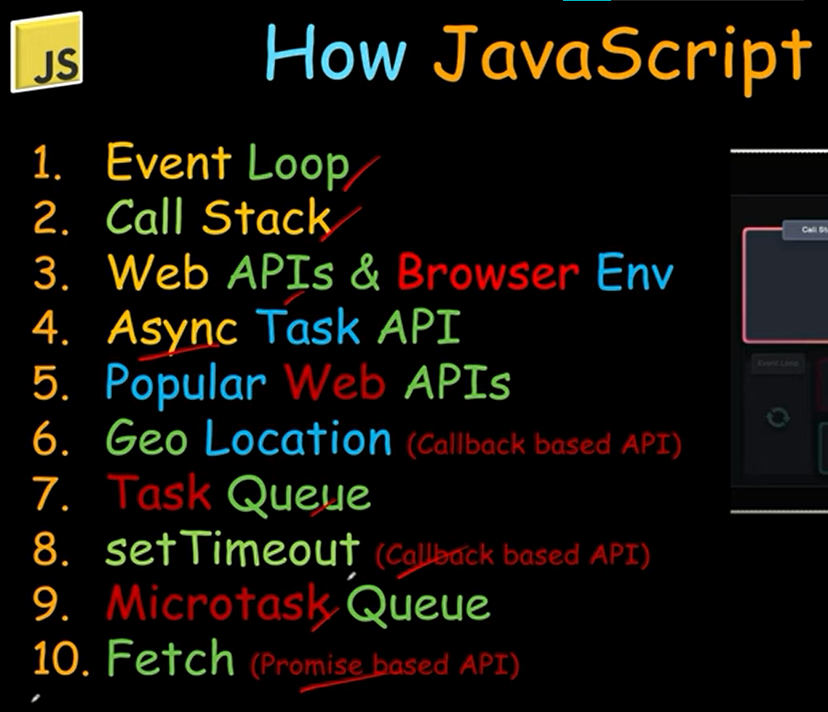
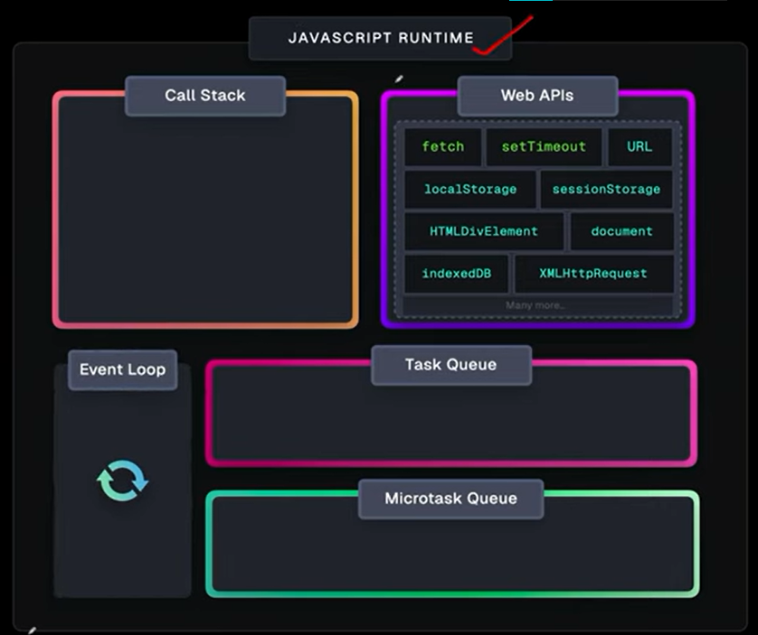

// IIFE     => {Immediately Invoked Function Expression}

// Basics  
(function(){
    let a = "Shivendra"
    console.log(a

    )
}());

// use case login  mai

(function(){
const Login = true;
if(Login){
    console.log("yes login hua hai");
    
}else{
    console.log("login nhi hua");
    
}

}())

// same cheez arrow fnc mai

(()=>{
    let logOut = false;
    if(logOut){
        console.log("nhi hua")
    }else{
        console.log("hogya");
        
    }
 
})

#  How Work JavaScript

## Event Loop

